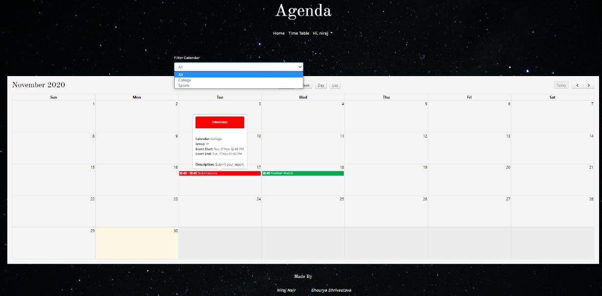

 

  <h1 align="center">Agenda</h3>
  <h3 align="center">
    A website which lets you manage and schedule your tasks.
     
     
## About The Project

Agenda can help you be more productive and maintain adequate work-life balance by:

•	Maintaining weekly Goals
•	Add personal commitments as appointments
•	Increase productivity with weekly overview

The project is a prototype of what I want to achieve. If you wish like contributing please contact me on any of the links mentioned below with your ideas.

#### Languages: Php, Javascript

#### Libraries: jQuery, Ajax

### Frameworks and plugins

* [Bootstrap](https://getbootstrap.com)
* [Full Calendar Plugin](https://fullcalendar.io/)
* [PHPMailer](https://github.com/PHPMailer/PHPMailer)

<!-- CONTACT -->
## Contact

Niraj Nair - [@NairNiraj](https://twitter.com/NairNiraj) - nirajnknair@gmail.com

Shourya Shrivastava - shouryashri14@gmail.com

Project Link: [Agenda](http://agenda.rf.gd/)
